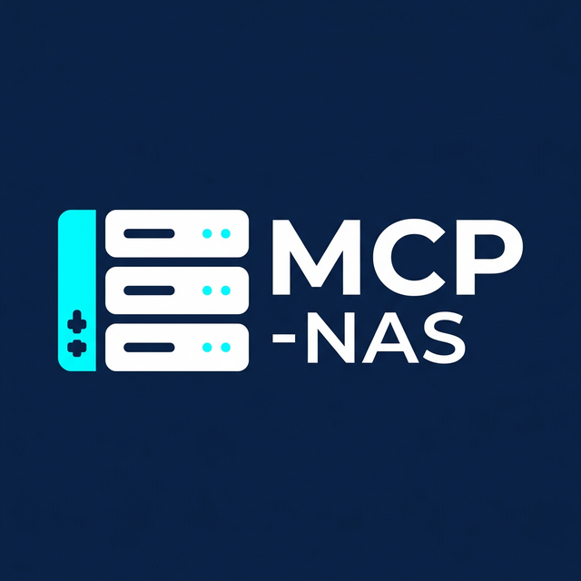

# 🛡️ MCP-NAS: AI-Powered Homelab Control

<div align="center">
  
</div>

**Control your Homelab via Claude Desktop with Maximalist Security**

[](https://modelcontextprotocol.io)
[]()

The `mcp-nas` agent is an experimental Model Context Protocol (MCP) server. It enables Claude to interact natively with a Linux/NAS system via SSH for real-time monitoring, Docker management, and security intelligence.

---

## ✨ Philosophy & "Zero-Trust" Security
This project is designed to guarantee maximum security in a homelab environment:
- **Agentless Architecture**: No complex installations on the NAS; communication relies on **standard SSH**.
- **Least Privilege**: Utilizes a restricted user (`mcp-agent`) with `sudo` rights strictly limited by a whitelist.
- **Strong Authentication**: Asymmetric keys (ED25519) exclusively.
- **Isolation**: Sensitive data is passed through the local environment; nothing is hardcoded.

---

## 🚀 Features

### 📊 System & Hardware Monitoring
- **Real-Time Stats**: CPU, RAM, Uptime, Load (via OMV API or system commands).
- **Storage**: Detailed disk status, used/total space, SMART status.
- **Maintenance**: Instant checks for pending system updates.

### 🐳 Docker Management
- **Monitoring**: Container list, status, and CPU/RAM performance.
- **Smart Logs**: Targeted log retrieval or aggregated reports across all containers.

### 🛡️ Network & Security
- **CrowdSec**: Detection and listing of active bans, including reasons and origins.

---

## 🛠️ Installation & Configuration

### 1. NAS Preparation
Run the setup script on your NAS (as root) to create the secure environment:
```bash
# On the NAS
chmod +x setup-mcp-nas.sh
sudo ./setup-mcp-nas.sh "mcp-agent" "YOUR_SSH_PUBLIC_KEY"
```

### 2. Local Agent Compilation
The agent runs natively via Node.js on your host machine.
1. Install dependencies: `npm install`
2. Build the project: `npm run build`

### 3. Claude Desktop Configuration
Modify your `%APPDATA%/Claude/claude_desktop_config.json` file:
```json
"mcpServers": {
  "mcp-nas": {
    "command": "node",
    "args": ["C:/Path/To/mcp-nas/build/index.js"],
    "env": {
      "NAS_HOST": "192.168.1.X",
      "NAS_PORT": "22",
      "NAS_USER": "mcp-agent",
      "NAS_KEY_PATH": "C:/Users/YOUR_USER/.ssh/id_ed25519"
    }
  }
}
```
*(If installed globally via npm, the command can be `"npx", "args": ["-y", "@cneuen/mcp-nas"]`)*

---

## 🧭 How to interact with your NAS?

Once configured, simply ask Claude:
- *"Give me a health report of my NAS."*
- *"Is there enough space left on my drives?"*
- *"List the containers running on the NAS."*
- *"Have any IPs been banned recently by CrowdSec?"*
- *"Do I need to update my system?"*

---
*Made with ❤️ for Homelab enthusiasts.*
